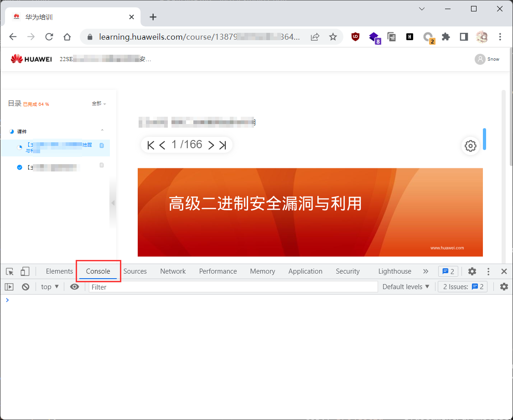
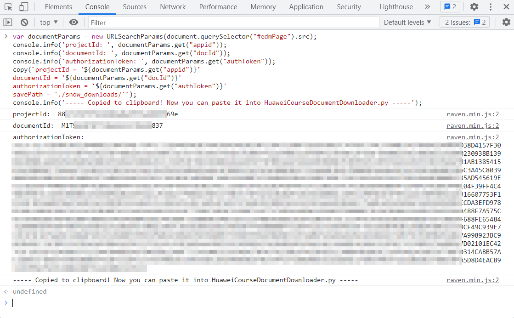
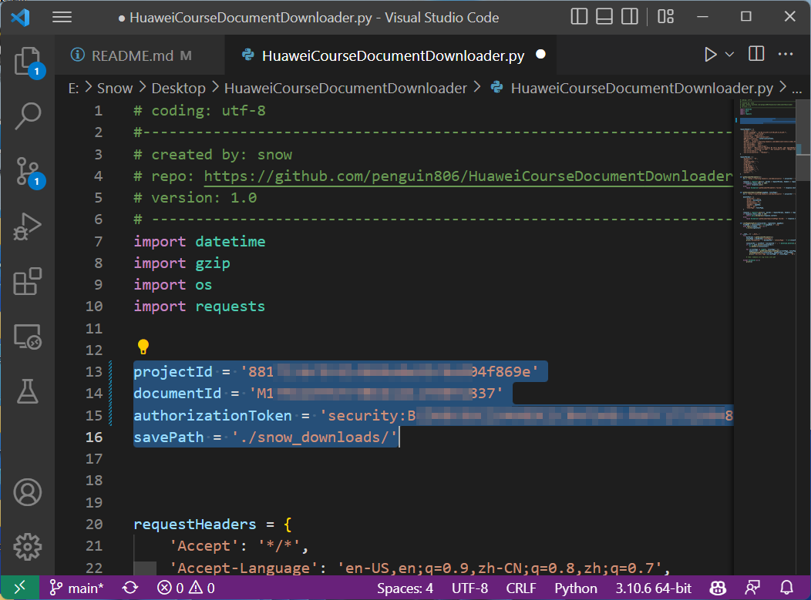

# HuaweiCourseDocumentDownloader
Dump document from `learning.huaweils.com/course/` 

## Installation
```
git clone https://github.com/penguin806/HuaweiCourseDocumentDownloader.git
pip install requests
```

## Getting Started
1. Login to `learning.huaweils.com`, navigate to the course  page you want to download, and press `F12` to open DevTools.
    
2. Switch to `Console` tab.
3. Paste the following code into the console and press `Enter`:
    ```javascript
    var documentParams = new URLSearchParams(document.querySelector("#edmPage").src);
    console.info('projectId: ', documentParams.get("appid"));
    console.info('documentId: ', documentParams.get("docId"));
    console.info('authorizationToken: ', documentParams.get("authToken"));
    copy(`projectId = '${documentParams.get("appid")}'
    documentId = '${documentParams.get("docId")}'
    authorizationToken = '${documentParams.get("authToken")}'
    savePath = './snow_downloads/'`);
    console.info('----- Copied to clipboard! Now you can paste it into HuaweiCourseDocumentDownloader.py -----');
    ```
4. This will print out the `projectId`, `documentId` and `authorizationToken` of the document you'd like to download. And it will also copy the necessary code to your clipboard.
    
5. Paste the code into `HuaweiCourseDocumentDownloader.py` and replace the corresponding variables **(Line 13 ~ 16)**.
    
6. Run `HuaweiCourseDocumentDownloader.py`, wait for the download to finish.
7. The downloaded files will be saved in the directory you specified in `savePath` variable.